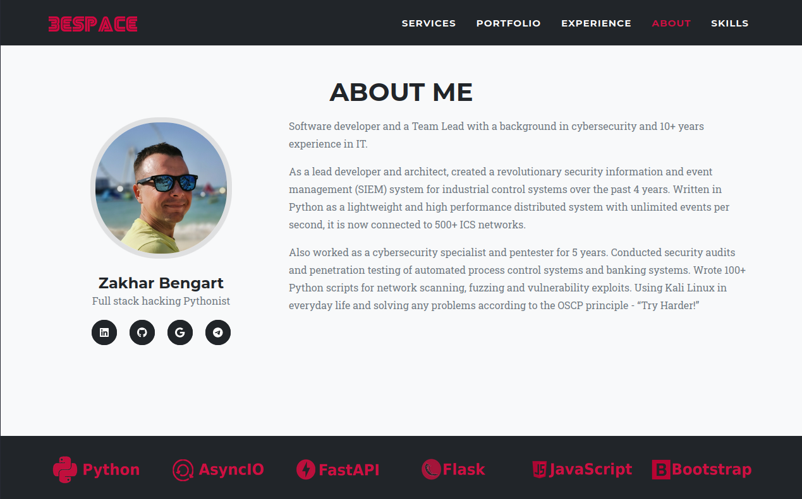

  

## :red_square: Getting Started
[3e's space](https://zakharb.github.io/) is my Portfolio site developed to showcase my projects and experience.  
There you can also find short description and contacts about me.  
Site is created using HTML, CSS and vanilla JS.  

  

## :red_square: My Projects

	

## :red_square: About me

  

